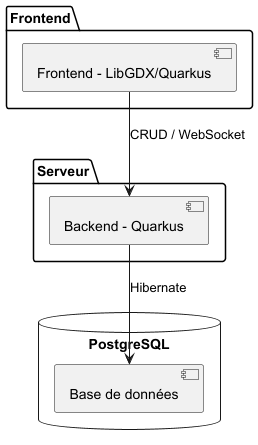

# Cahier des charges

## Introduction

### Contexte

Ce projet est réalisé dans le cadre de l’unité d’enseignement Projet de groupe (PDG) à la HEIG-VD. Cette unité a pour objectif, à travers la réalisation en équipe d’une application de taille importante, de mettre en pratique les compétences acquises durant la formation ainsi qu'acquérir de manière indépendante des connaissances sur des sujets nouveaux.

### Problématique

Les jeux basés sur la destruction de structures demandent aux joueurs de lancer différents projectiles sur une construction adverse pour tenter de la détruire. Le joueur doit notamment choisir où tirer et comment exploiter la physique du jeu pour faire le plus de dégâts possible. Cependant, ces jeux proposent généralement des niveaux prédéfinis et se jouent seul. Cela limite la possibilité pour les joueurs de développer leurs propres stratégies et de les confronter directement à celles d'autres joueurs.

L'objectif de notre projet est d'offrire aux joueurs la possibilité de redécouvrir ce principe dans un jeu multijoueur en 1VS1, où chaque joueur construit sa propre structure avant d'affronter son adversaire. Les joueurs peuvent ensuite s'attaquer en temps réel, en choisissant leurs tirs pour tenter de détruire la structure adverse. Le but est de permettre aux joueurs de développer leurs propres stratégies de construction et d'attaque afin de déterminer lequel est le meilleur.

### Cadre du projet

#### Principe du jeu

L’objectif du projet est de développer un jeu multijoueur en ligne 1VS1 inspiré du principe d’Angry Birds. Deux joueurs s’affrontent dans une partie composée de plusieurs manches, le premier joueur à en remporter la majorité remportant la partie. Chaque manche se déroule en deux phases : une phase de construction, durant laquelle chaque joueur crée une structure destinée à protéger son roi, puis une phase de bataille, durant laquelle les joueurs utilisent différents types de robots qu’ils catapultent afin de tenter de détruire la structure adverse. Le premier joueur à détruire le remporte adverse remporte la manche.

Lors de la phase de construction, les joueurs disposent de différents types de blocs, chacun possédant des caractéristiques propres qui influencent leur comportement lors des collisions. Pendant la phase de bataille, les collisions subies par les blocs leur infligent des dégâts en fonction du type et de la vitesse de l’impact. Leurs points de vie diminuent en conséquence et un bloc est détruit lorsque ceux-ci atteignent zéro.

#### Réalisation

La réalisation du jeu nécessite notamment la mise en place d’une simulation physique (aidée par un framework spécialisé) permettant de gérer les mouvements des robots et des blocs, ainsi que les collisions et leurs conséquences. Cette simulation doit prendre en compte les caractéristiques des différents éléments afin de reproduire de manière cohérente leurs interactions.

Le jeu repose également sur un serveur responsable de la gestion de l’état des parties en validant les actions effectuées par les joueurs. Il constitue ainsi la source de vérité du jeu et maintient un état cohérent entre les deux clients, notamment lors des échanges temps réel.

Enfin, le projet comprend la gestion des comptes utilisateurs, l’authentification, la mise en place d’un système de file d'attente pour trouver une partie et la gestion des parties jusqu’à avoir un gagnant.

## Description

### Fonctionnels

- Menu
    - Au lancement de l'app, on arrive sur un menu
    - Un bouton permet de se connecter à un compte existant ou bien de s'en créer un

- Gestion de compte
    - Chaque utilisateur possède un compte avec mail, username, et mot de passe
    
- Trouver une partie 1v1 en ligne
    - Bouton pour lancer une partie en ligne
    - Attente d'un deuxième joueur si nécessaire (file d'attente)
    - Une fois deux joueurs présents, lancer la partie en passant à la phase construction
    
- Phase 1 : construction
    - Obtention aléatoire d'un certain nombre de blocs à placer
    - Placement dans la zone constructible des blocs par le joueur via drag and drop
    - Placement dans la zone constructible du roi par le joueur via drag and drop 
    - Placement impossible d'un bloc sur un autre bloc
    - Bouton pour tester l'intégrité de la structure
    - Bouton pour valider la structure
    - Une fois les structures des deux joueurs validées, passer à la phase de bataille
    - Au bout d'un certains temps, même si les structures ne sont pas validées, passer à la phase de bataille avec les structures actuelles
    - A la fin de la construction, le serveur valide la construction (nombre de blocs posés, positionnement, ...)

- Phase 2 : bataille
    - Parrallèlement, en temps réel, les joueurs catapulte un robot (de différents types) sur la base du joueur adverse
    - Les robots touchant des blocs sont ralentis/rebondissent en correspondance avec le type de bloc touché
    - Les robots disparaissent une fois que leur vitesse passe un certain seuil (proche de 0)
    - Pour lancer un nouveau robot, il faut que le dernier robot ait disparu et qu'un délai dépendant du type de robot soit passé
    - Les robots lancées font des dégats aux blocs de la base adverse qu'ils collisionnent
    - Les blocs colisionnés qui ont encore des points de vie sont simplement poussés mais s'ils n'ont plus de vie ils sont détruits
    - Les blocs se colisionant entre eux se font des dégats proprotionnel à la vitesse et au type du bloc colisionné
    - Un blocs tombant tout seul ne se fait pas de dégat à lui même
    - La victoire revient au premier joueur détruisant le roi adverse
    - Le serveur valide chaque tire (robot disponible, délais entre les tirs, ...) et renvoie l'état de ses calculs pour que le client puisse actualiser son état si nécessaire

- Fin de la partie
    - Une fois un joueur victorieux, un écran de fin de partie (victore/défaite) est affiché chez chacun des joueurs
    - L'écran de victoire/défaite permet de relancer une partie ou de retourner au menu
    - En cas de déconnection, le joueur restant gagne la partie

### Non fonctionnel
- Le serveur doit supporter 32 joueurs simultanés
- Le serveur se redémarre seul en cas de crash
- Le serveur doit gérer proprement la déconnection d'un joueur
- Le serveur doit être l'unique source de vérité
- Le nombre de rollback visible par manche doit être de maximum 2
- Le delai maximum d'une requête ne doit pas dépasser 200 ms pour 95 % d'entre elles
- On doit au moins générer 30 images par secondes
- Les temps de chargements ne doivent pas dépasser 5 secondes
- Les mots de passes doivent être hashé grâce à une librairie digne des standarts de l'industrie
- Le serveur doit être protegé contre les injections sql
- Rediriger les requêtes http vers https

## Architecture
### Description préliminaire de l'architecture

Notre application sera composée d'un frontend permettant d'afficher et de faire tourner le jeu côté client, ainsi que d'un serveur backend qui servira de source unique de vérité, assurera la persistance des données nécessaires et gérera l'authentification des utilisateurs. Une base de données relationnelle sera également nécessaire afin de stocker les informations utiles au bon fonctionnement de l'application, comme les comptes utilisateurs. Un ORM sera par ailleurs utilisé afin de résoudre les problèmes de différence de structure entre les données manipulées par le backend et celles stockées en base de données (impedance mismatch). Enfin, un pipeline CI/CD permettra d'automatiser les tâches redondantes telles que les tests et le déploiement.

### Description des choix techniques

Nous avons tout d'abord décidé de travailler avec le langage Java, ce qui a orienté l'ensemble de nos choix techniques.

Concernant le frontend, l'objectif était de choisir un outil permettant de faire le rendu du jeu. Plusieurs options existent, notamment des bibliothèques graphiques comme PixiJS, ou des moteurs de jeu (game engines) comme Phaser, Unity, Godot ou LibGDX. Par souci de simplicité, nous nous sommes orientés vers un moteur de jeu, qui met à disposition de nombreuses fonctionnalités telles qu'une boucle de gameplay et un système de physique, contrairement aux bibliothèques de rendu qui se limitent à l'affichage de sprites. Nous avons également souhaité privilégier un outil bénéficiant d'une large communauté, afin de disposer d'une documentation riche et de nombreux exemples facilitant son apprentissage. Enfin, comme mentionné précédemment, nous avons privilégié une solution permettant de coder en Java. Nous avons donc choisi le framework LibGDX, qui nous permet de faire le rendu du jeu en temps réel côté client, ainsi que de communiquer avec notre backend via HTTP (.NET), pour effectuer des requêtes CRUD ou établir des connexions WebSocket selon nos besoins.

Notre backend a pour rôle de valider les entrées utilisateur, de gérer les différents accès à nos endpoints, ainsi que l'authentification des utilisateurs et la persistance des données. Pour cela, nous avions le choix entre plusieurs frameworks tels que Quarkus, Spring Boot ou Play. Nous nous sommes orientés vers un framework que nous connaissions déjà et avec lequel nous avions de l'expérience : Quarkus, qui répond à l'ensemble de nos besoins.

Pour notre base de données, nous avons également opté pour une technologie que nous maîtrisions déjà, à savoir PostgreSQL comme SGBD. Pour faire le lien entre notre backend et notre base de données, nous avons choisi un ORM que nous avions déjà utilisé, Hibernate, plutôt que de nous tourner vers d'autres outils que nous ne connaissions pas mais qui auraient pu offrir un résultat similaire, comme JOOQ par exemple.

Nous avons choisi GitHub comme gestionnaire de versions plutôt que GitLab ou Bitbucket. C'est une solution qui nous semblait la plus simple à mettre en œuvre et avec laquelle nous avions déjà de l'expérience, notamment via GitHub Actions, que nous utiliserons pour mettre en place notre pipeline CI/CD. En ce qui concerne les tests nous allons utiliser Junit pour tester la logique de notre application et afin de s'assurer de la qualité du code nous allons utiliser Jacoco pour avoir un appercu du coverage des nos tests.

Enfin, afin de garantir un environnement reproductible et stable, nous avons décidé d'utiliser Docker et Docker Compose, permettant de lancer notre application et notre base de données de manière reproductible et coordonnée, facilitant ainsi le déploiement de l'application.

## Processus de travail

Le développement du projet suivra une approche agile pour permettre une progression régulière et faciliter l’adaptation aux problèmes ou changements rencontrés pedant la réalisation.

Le travail sera organisé en sprints de trois jours. Un backlog sera constitué des features qui découlent des user stories liées aux personas du projet. Au début de chaque sprint, les tâches à réaliser seront sélectionnées à partir du backlog en fonction de leur priorité et de l’avancement du projet. Les tâches seront ensuite réparties entre les membres du groupe et suivies au cours du sprint.

Le suivi des tâches sera effectué avec un tableau Kanban permettant de visualiser leur état d’avancement (Backlog, Ready, In progress, In review, Done) et de répartir le travail entre les membres du groupe. Ce suivi sera réalisé à l’aide des issues et des pull requests de GitHub, permettant notamment de suivre les tâches, les modifications apportées et leur revue avant intégration.

À la fin de chaque sprint, une réunion permettra de faire le point sur les tâches réalisées, celles encore en cours et les éventuelles difficultés rencontrées.

La gestion du code source reposera sur Git, avec GitHub comme plateforme de collaboration, et le modèle Git Flow. Une branche dev sera utilisée pour intégrer les fonctionnalités en cours de développement, tandis qu'une branche main contiendra uniquement les versions validées. Chaque fonctionnalité ou correction sera développée sur une branche dédiée, puis revue et testée avant d’être intégrée à dev. Les versions validées seront ensuite intégrées à main. L'intégration dans dev et main se fera uniquement via des Pull Requests et après la revue d'un autre membre du groupe. Aucune modification directe ne sera autorisée sur ces deux branches. De plus, chaque membre vise à faire au moins un commit par jour.

